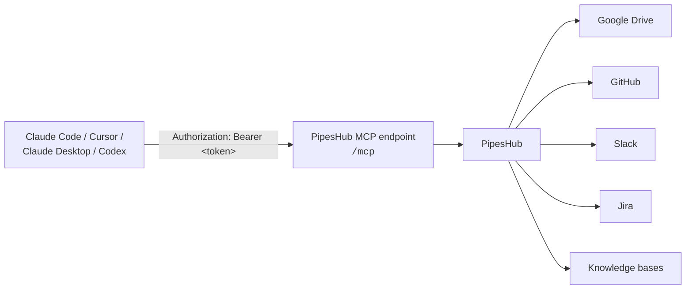

# Build a Company Knowledge MCP with PipesHub

**Give Claude, Cursor, or Codex secure access to your company's knowledge in about ten minutes.**

By the end of this guide your coding assistant will answer questions like *"why did we change the payment service architecture?"* using your team's documents, tickets, and conversations — with citations, and without ever seeing anything you aren't allowed to see.

## What you'll build

An MCP connection between your AI client and your PipesHub instance. MCP (Model Context Protocol) is the open standard that lets AI assistants call external tools. PipesHub exposes an MCP endpoint at `/mcp`; once your client is pointed at it, the assistant gains these tools:

| Tool | What it does |
|---|---|
| `pipeshub_search` | Permission-aware semantic search across everything connected to PipesHub |
| `pipeshub_chat` | Ask a question and get a cited answer synthesised from multiple sources |
| `pipeshub_get_record_content` | Read the full content of one document, ticket, or message |
| `pipeshub_download_record` | Fetch the original file |
| `pipeshub_directory` | Look up people and teams |
| `pipeshub_sources` | List which apps and knowledge bases are connected |
| `pipeshub_agents` | Run a PipesHub agent you've already built |

## What it looks like

You, in Claude Code:

> Why was the retry logic in the billing worker changed last quarter?

Claude, after calling `pipeshub_chat`:

> The retry logic was changed to use exponential backoff with jitter after a production incident on March 14 where synchronised retries overloaded the payments provider. The change was made in PR #482 and discussed in #eng-payments before merging. The design rationale is in the "Billing worker resilience" doc.
>
> Sources: `PR #482 — Add jittered backoff to billing worker`, `INC-2031 postmortem`, `#eng-payments (Mar 15)`, `Billing worker resilience (Google Drive)`

Four sources, three systems, one answer — and if you weren't in the group that can read the postmortem, that source simply wouldn't appear.

## Architecture



Your client talks to PipesHub over Streamable HTTP with a bearer token. PipesHub does the retrieval, enforces the permissions of whoever owns the token, and returns cited results. Nothing runs locally except your client.

## Prerequisites

- **A running PipesHub instance.** If you don't have one, the [quickstart](https://github.com/pipeshub-ai/pipeshub-ai#-quickstart-recommended) gets you a local Docker instance at `http://localhost:3000`. Complete the first-run setup in the browser (create your account, add an LLM provider) — search returns errors until an LLM is configured.
- **Something to search.** Either connect a source (Google Drive, GitHub, Slack, Jira, and [many more](https://github.com/pipeshub-ai/pipeshub-ai#connectors)) or, for the fastest start, upload a handful of documents to a knowledge base in the PipesHub UI.
- **One of these clients:** Claude Code, Cursor, Claude Desktop, or Codex CLI.

You do **not** need to be a PipesHub admin. Everything below works with a normal user account.

## Step 1 — Mint a Personal Access Token (2 minutes)

A Personal Access Token is a long-lived credential that acts as *you*. Results respect your own permissions, which is exactly what you want for a personal assistant.

1. Open PipesHub and go to **Workspace → Developer settings → Personal Access Tokens**.
2. Click **New token**. Give it a name like `claude-code`, pick an expiry (30, 90, or 365 days), and keep the default scopes.
3. Copy the two lines PipesHub shows you. They look like this and are shown **only once**:

```bash
PIPESHUB_MCP_URL=http://localhost:3000/mcp
PIPESHUB_MCP_TOKEN=eyJhbGciOi...
```

4. Export them in your shell so the client configs below can pick them up:

```bash
export PIPESHUB_MCP_URL=http://localhost:3000/mcp
export PIPESHUB_MCP_TOKEN=eyJhbGciOi...
```

> Using PipesHub Cloud or a company instance? The URL will be `https://<your-instance>/mcp` instead of localhost. Everything else is the same.

## Step 2 — Connect your client (3 minutes)

Pick one. Each option is a single command or a small config file; the exact files are in this folder.

<details>
<summary><strong>Claude Code</strong></summary>

One command, using the values you exported:

```bash
claude mcp add --transport http pipeshub "$PIPESHUB_MCP_URL" \
  --header "Authorization: Bearer $PIPESHUB_MCP_TOKEN"
```

Add `--scope user` to make it available in every project instead of just the current one. Then verify:

```bash
claude mcp list
```

You should see `pipeshub` with a connected status. The equivalent shell script is in [`claude-code/add-pipeshub.sh`](claude-code/add-pipeshub.sh).

</details>

<details>
<summary><strong>Cursor</strong></summary>

Create `.cursor/mcp.json` in your project (or add to Cursor Settings → Tools and Integrations → New MCP Server):

```json
{
  "mcpServers": {
    "pipeshub": {
      "url": "${env:PIPESHUB_MCP_URL}",
      "headers": {
        "Authorization": "Bearer ${env:PIPESHUB_MCP_TOKEN}"
      }
    }
  }
}
```

Cursor reads the two variables from your environment, so the file contains no secrets and is safe to commit. A copy is in [`cursor/mcp.json`](cursor/mcp.json). Restart Cursor and check the MCP panel shows the PipesHub tools.

</details>

<details>
<summary><strong>Claude Desktop</strong></summary>

Claude Desktop connects through a small local bridge (the `@pipeshub-ai/mcp` package) rather than directly over HTTP. Add this to `claude_desktop_config.json`, replacing the two placeholders with your instance's base URL (without `/mcp`) and your token:

```json
{
  "mcpServers": {
    "pipeshub": {
      "command": "npx",
      "args": [
        "@pipeshub-ai/mcp", "start",
        "--server-url", "http://localhost:3000",
        "--bearer-auth", "YOUR_PIPESHUB_MCP_TOKEN"
      ]
    }
  }
}
```

Requires Node.js 18+. A copy is in [`claude-desktop/claude_desktop_config.json`](claude-desktop/claude_desktop_config.json). Restart Claude Desktop; the PipesHub tools appear under the tools icon.

</details>

<details>
<summary><strong>Codex CLI</strong></summary>

Add to `~/.codex/config.toml` (or `.codex/config.toml` in your project):

```toml
[mcp_servers.pipeshub]
url = "http://localhost:3000/mcp"
bearer_token_env_var = "PIPESHUB_MCP_TOKEN"
```

`bearer_token_env_var` is the *name* of the environment variable holding the token, so the config file stays secret-free. A copy is in [`codex/config.toml`](codex/config.toml). Verify with `codex mcp list`.

</details>

<details>
<summary><strong>Omnigent agents</strong></summary>

If you use [Omnigent](https://github.com/omnigent-ai/omnigent) to run agents, a ready-made PipesHub agent ships with it:

```bash
PIPESHUB_MCP_URL=... PIPESHUB_MCP_TOKEN=... omnigent run examples/pipeshub/
```

Or attach PipesHub to any session from the session info panel → **Manage MCP Servers**, using the same URL and an `Authorization: Bearer <token>` header.

</details>

## Step 3 — Ask something (1 minute)

Try a question that only your company's data can answer. Good first questions have the shape *"why did we…"* or *"what do we know about…"* because they force the assistant to combine sources:

- *"What's our current policy on taking on-call over a public holiday?"*
- *"Summarise the last three decisions we made about the search ranking service."*
- *"Which customers have complained about export timeouts, and is there an open ticket?"*

Watch which tools the assistant calls. A good answer usually starts with `pipeshub_search` or `pipeshub_chat`, then `pipeshub_get_record_content` on one or two results to read the details. Every claim in the answer should trace back to a named source.

More starter questions, grouped by team, are in [`demo/queries.md`](demo/queries.md).

## Test that permissions are real

Ask about something you know exists but that you don't have access to — a document in a restricted Drive folder, a private channel you're not in. The assistant won't find it. It's not hiding the answer; PipesHub never returned it, because the token is yours and the retrieval is filtered by your permissions before anything reaches the model.

This is the property that makes it safe to connect an AI assistant to company data at all, and it's the part a home-grown setup almost never gets right.

## Why naive RAG isn't enough

The obvious way to give an assistant your documents — embed everything, do a vector search, hand the top chunks to the model — breaks on real company data in four predictable ways. Take one engineering question, *"why did we change the retry logic in the billing worker?"*:

1. **Permissions.** The postmortem that explains the change is in a folder only the payments team can read. Naive RAG either indexes it and leaks it to everyone, or skips it and can't answer.
2. **Cross-system relationships.** The full answer lives in a GitHub pull request, a Jira incident, a Slack thread, *and* a design doc. Ten similar-sounding chunks from one source aren't the same as one chunk from each of four sources that reference each other.
3. **Entity resolution.** "The billing worker" is `svc-billing-worker` in GitHub, "Billing Worker" in Jira, and "the worker" in Slack. Embeddings of those strings don't reliably land near each other.
4. **Explainability.** Engineers won't act on an answer they can't verify. The answer needs to say *which* PR, *which* ticket, *which* thread.

PipesHub handles these with permission-aware retrieval (filtered per user before ranking), a knowledge graph that records how records across systems relate to each other, and citations on every answer. The MCP tools simply expose that to your assistant.

## Customize it

- **Limit what the assistant can reach.** Personal Access Tokens carry scopes. Create a token with only `semantic:read` and `kb:read` if you want search without the ability to run agents or download files.
- **Scope searches to one app.** `pipeshub_search` accepts filters for specific connectors or knowledge bases — useful in a project-level MCP config for a repo that only cares about one system.
- **Use an agent instead of raw search.** If you've built a PipesHub agent with its own instructions and tools, `pipeshub_agents` lets the assistant delegate to it.
- **Full tool reference** and per-client details, including OAuth-app setup for shared and service-account use, are in the [`pipeshub-ai/mcp-server`](https://github.com/pipeshub-ai/mcp-server) README.

## Next steps

- **Connect a real source.** The knowledge-base upload gets you started; the interesting answers come when GitHub, Slack, Jira, and Drive are all connected and PipesHub can join them.
- **Build enterprise search for your whole team** — the [private-enterprise-search](../private-enterprise-search/) example puts the same retrieval behind a search box.
- **Call it from your own code** — the [sdk-starter](../sdk-starter/) example uses the Python and TypeScript SDKs.
- **Built something with this?** Open a [showcase issue](https://github.com/pipeshub-ai/examples/issues/new?template=showcase.yml) and we'll feature it.
