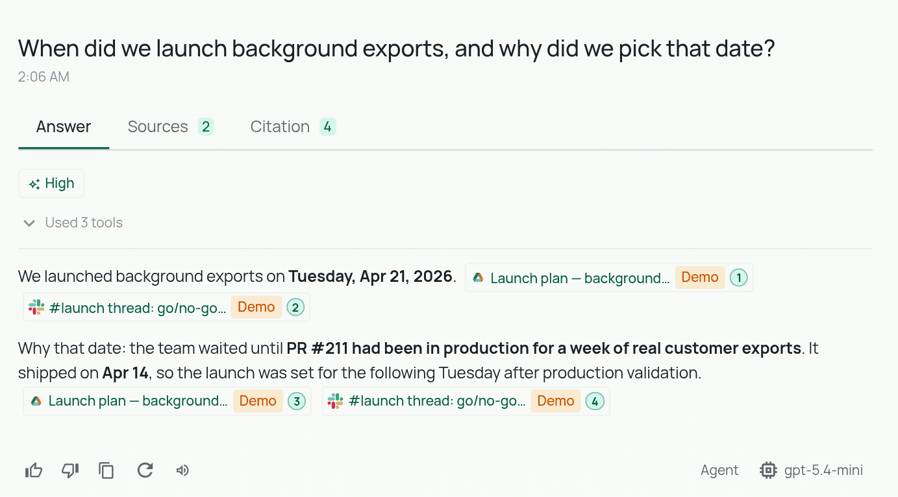

# Marketing Launch Copilot

**Write about a launch, or plan the next one, without piecing it together by hand.** This Build Pack for marketing teams answers the questions a launch raises: *when did this ship, what was the launch waiting for, how did it do, and what is next?* It searches launch plans, results, the launch channel and the engineering records a launch depends on, and it says where each part of the answer came from. See [the questions it answers](#questions-it-answers).

This is a recipe, not a new application. It is PipesHub, one of the AI clients
you already use, and a short set of instructions for that client. You can try
it on the Acme Corp demo data without connecting anything, then point it at
your own tools.

## What you get



*PipesHub's own chat answering this pack's first question, signed in as Alice, on the Acme Corp demo data. With this pack, your AI client gets the same sources through MCP and follows the pack's instructions on top.*

## The problem

A launch date depends on engineering, the evidence for the launch story lives
in the release and the customer cases, the go/no-go happens in a chat
channel, and the results arrive two weeks later in a separate document.
Anyone writing about the launch, or planning the next one, has to piece those
together, and has to know which plans are still embargoed.

**Who it's for:** product marketers, launch managers and communications teams.

## What it reads

| Source | What it holds in the demo |
| --- | --- |
| Google Drive | The Marketing folder: the background exports launch plan, launch results, the 2026 messaging guide |
| Slack | The `#launch` channel, including the go/no-go thread of 16 April |
| Google Drive (restricted) | The Launch core folder, readable by the launch core team only |
| GitHub and Drive | The engineering side: PR #211 and the April release notes |

With your own data, these are your connectors in PipesHub. Any mix works.

## How it fits together

```
your client (Claude Code, Cursor, Codex, Omnigent)
   │   the instructions in AGENTS.md: when to search, what to cite
   ▼
PipesHub MCP server  ── your personal access token ──►  only what you may see
   │
   ▼
one index over every connected system, with permissions
```

The client does the reasoning. PipesHub does the search across every
connected system, filters it by what the signed-in person may see, and returns
records with their sources. The pack's instructions tell the client when to
search, what to follow and what to cite.

## Try it on the demo data

You need a PipesHub release that includes the **Demo** connector (the first
release after 0.8.0; on 0.8.0 and earlier it is not in the connectors list),
with the extended Acme Corp demo data that adds the Marketing folder, `#launch` channel and launch core folder. That data is
in [pipeshub-ai#3585](https://github.com/pipeshub-ai/pipeshub-ai/pull/3585),
which is not merged yet; until it ships, the Marketing Launch Copilot questions have
nothing to find.

1. **Load the demo.** In PipesHub, go to **Workspace → Connectors**, pick
   **Demo**, add it as a team connector and enable it. If you set PipesHub up
   with `bootstrap-first-run.sh`, `PIPESHUB_DEMO_DATA=1` in its env file does
   the same. Indexing takes a minute or two. The
   [demo data page](https://docs.pipeshub.com/demo-data) has the details,
   including the two sample employees, Alice and Bob.
2. **Connect your client.** Follow steps 1 and 2 of the
   [Company Knowledge MCP](../../company-knowledge-mcp/) tutorial: create a
   personal access token and add PipesHub to Claude Code, Cursor, Codex or
   Claude Desktop. To see the permission lesson, create the token while signed
   in as the sample user named in [demo/questions.md](demo/questions.md).
3. **Add the instructions** for your client, below.
4. **Ask the questions** in [demo/questions.md](demo/questions.md).

### Instructions for your client

The instructions are in [AGENTS.md](AGENTS.md). Put them where your client
reads project instructions:

- **Claude Code:** append [claude-code/CLAUDE.md.snippet](claude-code/CLAUDE.md.snippet)
  to your project's `CLAUDE.md`.
- **Codex:** copy [AGENTS.md](AGENTS.md) into your project root.
- **Cursor:** add the text of [AGENTS.md](AGENTS.md) as a project rule.
- **Omnigent:** the [omnigent/marketing-launch](omnigent/marketing-launch/) folder is a
  complete agent. Run it from this pack's folder (`packs/marketing`) in two
  terminals, and set the PipesHub settings in both: the server reads them when
  it registers the agent, and the host passes them to the agent when it runs.

  ```bash
  # In both terminals
  export PIPESHUB_MCP_URL=http://localhost:3000/mcp   # https:// for a PipesHub on another machine
  export PIPESHUB_MCP_TOKEN=...   # your personal access token
  export OMNIGENT_RUNNER_ENV_PASSTHROUGH=PIPESHUB_MCP_URL,PIPESHUB_MCP_TOKEN

  # Terminal 1: the server, which registers the agent
  omnigent server --agent ./omnigent/marketing-launch/

  # Terminal 2: the host, which runs it
  omnigent host --server http://localhost:6767
  ```

  If an Omnigent server is already running, stop it first with
  `omnigent server stop`; otherwise `omnigent server` reuses it and the agent
  is not registered.

  Then open `http://localhost:6767` and choose **marketing-launch** from the agent
  menu in the message box (under *Agents → Other…*).

## Questions it answers

The full list, with the records each answer should cite and what test runs
cited, is in [demo/questions.md](demo/questions.md). Two of them:

- *"When did we launch background exports, and why did we pick that date?"* 21 April, because the launch waited for PR #211 to be live for a week; the answer joins the launch plan with the engineering record and the go/no-go thread.
- *"What is the next product we are launching after background exports?"* Alice, on the launch core team, gets the embargoed brief; Bob gets nothing, because PipesHub filters by the person before the agent sees anything.

## Why naive RAG isn't enough

The obvious alternative is to embed everything, take the top few matching
chunks for a question, and hand them to a model. On the demo data, two things
go wrong with that. Each was checked on a running instance with a plain
top-10 search.

1. **The top matches mix two stories.** For *"When did we launch background
   exports, and why did we pick that date?"*, the top ten did include the
   launch plan, the `#launch` thread and PR #211, but mixed with the sales
   story around the same fix: the Northwind call notes for Alice, the `#deals`
   thread for Bob. A model summarising them has to keep the launch and the
   renewal apart.
2. **The next launch ranks below the last one, and not everyone may see
   it.** For *"What is the next product we are launching after background
   exports?"*, Alice's top ten put three documents about the background
   exports launch above the embargoed brief, which came fourth. A model that
   reads only the first few would answer about the launch that already
   happened. Bob's results never included the brief at all, because PipesHub
   filters by the person before ranking.

## Make it yours

- **Point it at your own tools.** Connect your document store, chat and
  engineering tools in PipesHub; the launch story needs both sides.
- **Add your messaging rules** to [AGENTS.md](AGENTS.md), or point the agent at
  your style guide by name.
- **Keep embargoes in permissions.** Put embargoed plans in a restricted
  folder or group; the instruction to flag embargoes is a second line of
  defence, not the first.
- **Keep it read-only.** For search only, create the personal access token
  with the `semantic:write`, `kb:read` and `connector:read` scopes, as the
  [MCP tutorial](../../company-knowledge-mcp/#customize-it) describes.

## A sixty-second demo

[demo/video-script.md](demo/video-script.md) is a shot-by-shot script for a
short screen recording on the demo data.

## Built something with it?

Open a [showcase issue](https://github.com/pipeshub-ai/examples/issues/new?template=showcase.yml)
and we'll feature it.
