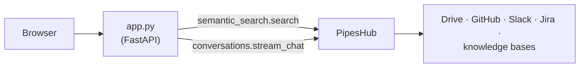

# Build Private Enterprise Search with PipesHub

**A permission-aware, citation-backed search page across your company's data — running on your own infrastructure.**

This is the "Glean-style" experience: one search box that reaches every connected system, only ever shows a person what they're allowed to see, and gives a synthesised answer with sources alongside the raw results. The example is deliberately small — one file — so you can see exactly where the value comes from and then build your own interface on top.

## What you'll build

A small web app with a search box. For each query it shows two things side by side:

- **A cited answer**, synthesised from the relevant records.
- **Matching records**, ranked, each linking back to the original document, ticket, or message.

Both are filtered by the permissions of the user whose token the app uses, before ranking happens.

## What it looks like

```
Company search
──────────────────────────────────────────────────────────────
[ why did we change the retry logic in the billing worker?  ] [Search]

ANSWER
The retry logic was changed to use exponential backoff with jitter after
the March 14 incident where synchronised retries overloaded the payments
provider. The change landed in PR #482 after discussion in #eng-payments…

  PR #482 — Add jittered backoff to billing worker     · GitHub
  INC-2031 postmortem                                  · Jira
  Billing worker resilience                            · Google Drive

MATCHING RECORDS
  Billing worker resilience                            · Google Drive
  "…retries were synchronised across all workers, which…"
  PR #482 — Add jittered backoff to billing worker     · GitHub
  …
```

## Architecture



The app is a thin layer: it makes the same two SDK calls as the [sdk-starter](../sdk-starter/) and renders the results. PipesHub does retrieval, permission filtering, ranking, synthesis, and citation. Nothing about your data leaves your PipesHub instance.

## Prerequisites

- A running PipesHub instance with an LLM provider configured and something to search (a connected source, or documents uploaded to a knowledge base). The [quickstart](https://github.com/pipeshub-ai/pipeshub-ai#-quickstart-recommended) gives you a local instance.
- A **Personal Access Token** from **Workspace → Developer settings → Personal Access Tokens → New token**.
- Python 3.10+ with [`uv`](https://docs.astral.sh/uv/) (or plain `pip`).

## Run it

```bash
export PIPESHUB_URL=http://localhost:3000
export PIPESHUB_BEARER_AUTH=phpat_eyJhbGciOi...

cd python
uv run app.py            # installs pipeshub-sdk, fastapi, uvicorn on first run
```

Open **http://localhost:8080** and search for something only your company's data can answer.

## Test that permissions are real

The app searches as the person who owns the token. Mint a token as a user who is *not* in a particular team's Drive folder or Slack channel, run the app with it, and search for something that lives there. It won't appear — not because the app hides it, but because PipesHub never returned it. This is what makes it safe to put a single search box in front of the whole company.

## Why naive RAG isn't enough

The obvious build — index every document into a vector store, search it, hand the top chunks to a model — falls apart on real company data for four reasons this example sidesteps:

1. **Permissions.** A single shared index either leaks restricted documents or has to leave them out for everyone. PipesHub filters per user, per query, before ranking.
2. **Cross-system relationships.** The best answer to "why did we change X?" spans a pull request, a ticket, a chat thread, and a doc. A flat index returns ten similar chunks from wherever the wording matched; PipesHub's knowledge graph knows those four records are about the same thing.
3. **Entity resolution.** The same service is `svc-billing-worker` in GitHub, "Billing Worker" in Jira, and "the worker" in Slack. Embeddings don't reliably connect them; the graph does.
4. **Explainability.** People won't act on an answer without a source. Every answer here carries citations back to the exact record.

## Customize it

- **Search one app or knowledge base** by passing `filters={"apps": ["drive"]}` or `filters={"kb": [...]}` to `semantic_search.search`.
- **Per-user search.** For a real deployment each person should search as themselves. Put the app behind your SSO and exchange the user's identity for a PipesHub token via an OAuth app (**Developer settings → OAuth Apps**) rather than using one shared Personal Access Token.
- **Stream the answer** to the page instead of collecting it: the SDK yields `TEXT_MESSAGE_CONTENT` events as tokens arrive; forward them over Server-Sent Events to the browser.
- **Replace the HTML** with your own front end. The two JSON endpoints — `/api/search?q=` and `/api/ask?q=` — are all a UI needs.

## Next steps

- Give an AI coding assistant the same retrieval directly: [company-knowledge-mcp](../company-knowledge-mcp/).
- Embed it in an existing internal tool: [sdk-starter](../sdk-starter/).
- Built a search experience on PipesHub? Open a [showcase issue](https://github.com/pipeshub-ai/examples/issues/new?template=showcase.yml).
